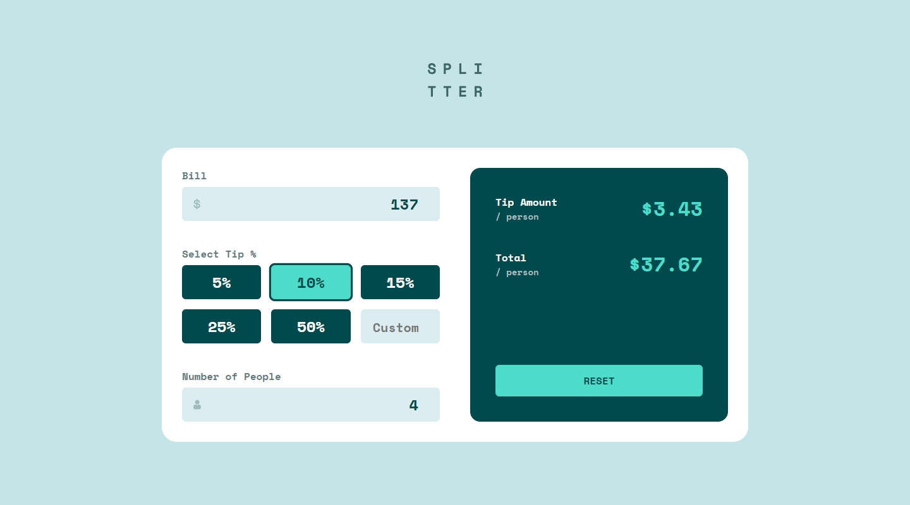

## Frontend Mentor Challenge 26 - Tip Calculator App

This is my solution to the [Tip Calculator App](https://www.frontendmentor.io/challenges/tip-calculator-app-ugJNGbJUX) challenge on [Frontend Mentor](https://www.frontendmentor.io/).

#

### Links. 🔗

- Live Site URL: https://tip-calculator-app-darkstarxdd.vercel.app/

#

### Screenshots of the Solution (Desktop, Error States & Mobile). 🔍




#

### Built with. 🔨

- HTML & CSS.
- TypeScript.
- Zod - Form Validation.
- Vite.

#

### Problems Faced / New Things Learned 🎓

- I visually hid the radio buttons, and styled the labels to look like the radio buttons. Based on the radio button’s checked or focused state, the label will be styled. I had done this before so i already had some experience with this.

- The tricky part was the 6th radio button, which technically doesn’t look like a radio button at all but rather an input where the user can input numbers. But in reality this too should be a radio button. Because if the 6th input is selected, any current selection on the other 5 radio buttons should be unchecked and if one of those radio buttons were checked then the 6th input should be unchecked. The solution was to have a radio button and as well as an `input type="number"`. The radio was visually hidden. The number input is what a user who uses their mouse clicks on. The radio button is what a keyboard user will focus on. So when the mouse click happened on the number input, the radio button needed to be checked. When a keyboard moved the focus to the radio button and made it checked, the number input should receive focus so that the user can actually type into the input field.

  ```ts
  customInput.addEventListener("focus", () => {
    if (customRadioButton instanceof HTMLInputElement) {
      customRadioButton.checked = true
    }
  })

  customRadioButton.addEventListener("change", () => {
    customInput?.focus()
  })
  ```

- You can use `formElement.reset()` to reset the form inputs to their default values, including unchecking checked radio buttons or checkboxes. I used to do this manually by assigning empty strings to inputs.

#

### Bugs. 🐛

- There is currently a bug where, if a user enters an invalid input (such as a negative number) as the custom tip and then selects an option from the provided tip radio buttons without correcting the invalid input, the error message does not disappear.

#

### Testing and Accessibility. 🧪

- Tested site usability with keyboard-only navigation.
- Used the Responsively App to check the site's appearance on various screen sizes, from 320x480 to 3000x2000.
- Set the browser font size on desktop to various values ranging from 9px to 72px to make sure everything on the site scales properly with the user's preferred browser font size.
- Zoomed the page in and out using Ctrl + Scroll wheel (up to 500%).
- Tested with the NVDA screen reader.
- Viewed the site on an iPhone 11 in both portrait and landscape modes.
- Performed Lighthouse and PageSpeed tests. ([PageSpeed Result.](https://pagespeed.web.dev/analysis/https-tip-calculator-app-darkstarxdd-vercel-app/t9ymq3ut1w?form_factor=mobile))

#

- Some Tools I Use - [DarkstarXDD/tools](https://gist.github.com/DarkstarXDD/4b1844eda12f34b667a0c36e05fcbdf9)
- My Frontend Mentor Profile - [@DarkstarXDD](https://www.frontendmentor.io/profile/DarkstarXDD)
